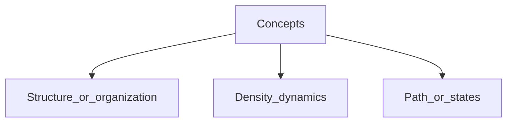

# Appendix to Universe and Mind 6
## Various side notes (draft)

Notes: 8.9.2023
Transferred here: 29.1.2024

### On FEP/AIF discussions on MLST Youtube ch. (which video?) and a note on a mention of "delayed gratification" which is not strictly gratification

Todor (T): Lenin, Pavlov: Todor Pavlov, "Theory of reflection", 1945

**Concepts**

Structure or organization
Density dynamics
Path or states

Friston 2010 - as Path (path integral?)) currently - states

25 min: Preserve your identity...

**T: **not inter ... but others ... ?

Max: "Physics of the mind" -- compare T.A.: TOUM: theory of Universe and Mind
Max: Multiscale Integration 2019

"Unified brain theory "

Max: Physics of the brain

1:12 
1:13 fluctuations  ... sufficient every goal ... enough ...
1:15 expected reward, utility, information gain 
**T:** Compare TOUM "expected..." - it can be wrong postfactum (including by the POV of the agent/predictor itself, also his model/self is changing, it's an estimation/guess)

"logP of occupying a goal state, goalness ... acting as returning to their attracting set ... of states "

T: Compare TOUM, summarized in the lecture from the 2010-2011 University course.

T: it is not delayed __gratification__ but delayed **planning, feedback, ... longer time horizon** (M.Levin's "light cone")

--> to M.Levin: care, compassion:  
-- Who judges it. The agent believes or may believe that she cares, but she cares for **her image** ... for that believe that she believes, cares etc., and she does for the representation of something else that, as longer the distance from it (bigger lightcone) in time, space, steps, transformations etc., as less the final cause, impact etc. could be convincingly caused, controlled, connected with the current causality-control unit (agent), unless she includes the spatio-temporal-domain-modality-universe-...-parts with which the future outcome, change, state etc. are connected with shorter distances.

On the confused definitions of the concept of "delayed gratification" see: https://artificial-mind.blogspot.com/2018/06/delayed-gratification-is-ill-defined.html
"Delayed gratification is an ILL-Defined Concept", T.Arnaudow, 2018
Extended version in Bulgarian in the detailed chronology of the book "The Prophets of the Thinking Mahchines ..." - when it's published.

